# How Create a Cloud File Server Using AWS, Filecloud, and Terrafrom

---

## Table of Contents

---

* Introduction
* Tutorial
* Prerequistes
* Creating a AWS key and secret

## Introduction

Have you ever used a cloud file sharing system such as One Drive, icloud or Google Drive? In this project we are going to create our own cloud file sharing system using FileCloud, AWS, and Terraform. First lets define and learn about the services and tools we will use. If your already familar with them you can skip ahead to the tutorial.

### What is FileCloud?

File cloud is a private cloud solution that offers file sharing and collaboration in the cloud. FileCloud allows us to host our own file server on our own hardware or hardware we rent such as AWS, GPC, or Azure. To learn more about [FileCloud Server](https://www.filecloud.com/filecloud-server/) click here.

### What is AWS?

Amazon Web Services [(AWS)](https://aws.amazon.com/what-is-aws/) is the world’s most comprehensive and broadly adopted cloud, offering over 200 fully featured services from data centers globally.

### What is Terraform?

[HashiCorp Terraform](https://developer.hashicorp.com/terraform/intro) is an infrastructure as code tool that lets you define both cloud and on-prem resources in human-readable configuration files that you can version, reuse, and share. You can then use a consistent workflow to provision and manage all of your infrastructure throughout its lifecycle. Terraform can manage low-level components like compute, storage, and networking resources, as well as high-level components like DNS entries and SaaS features.

---

## Prerequistes

---

Before you start you must have a AWS account, installed the AWS CLI, and download Terraform. Here are 2 tutorials you can follow along to get these setup. My setup will be on windows but you can easily follow along with Linux or Mac.

* [Setup AWS](https://youtu.be/bgPuPSPZe2U?t=176)
* [How to install Terraform on Windows](https://www.youtube.com/watch?v=n7fPpXxHWOY)
* [Install or update the latest version of the AWS CLI - AWS Command Line Interface (amazon.com)](https://docs.aws.amazon.com/cli/latest/userguide/getting-started-install.html)

# Tutorial

---

### 1. Creating a new user and creating a access key for our terminal.

Once you have created a AWS aacount we need to create a new user with admin access. It is best practice to not use the root user account. To do this we go to the search bar in the aws consle and type "iam". Select the first service that appears. Then click "add user" in the upper right hand corner. Create a user name and select next.

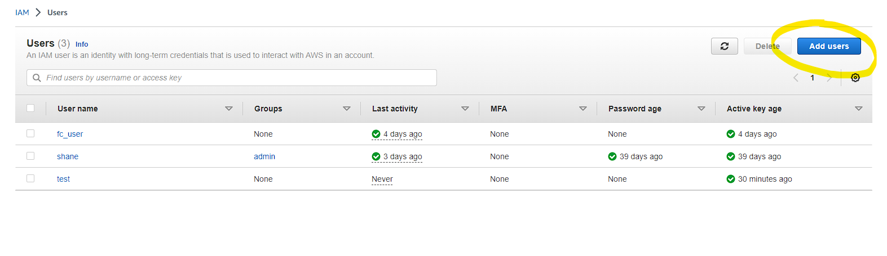

Next, you will want to select "attach ploicy directly" and serach "admin" in the ploicy search box and select "AdministaratorAccess". Continue until you created the user.

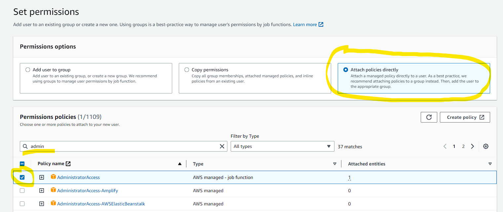

Once you have created the user select the user from the list of users. You will then select "Security Credentials" on the following screen and create a access key. On the next screen select "Command Line Interface (CLI)" option and continue till you created the access key. Your key name and secret will be available to download via a .csv. Before you click done open up a terminal in windows and enter the following command
`aws configure`
paste your access key and secret access key in the apporpriate promnts and press enter till you finished the configuration.

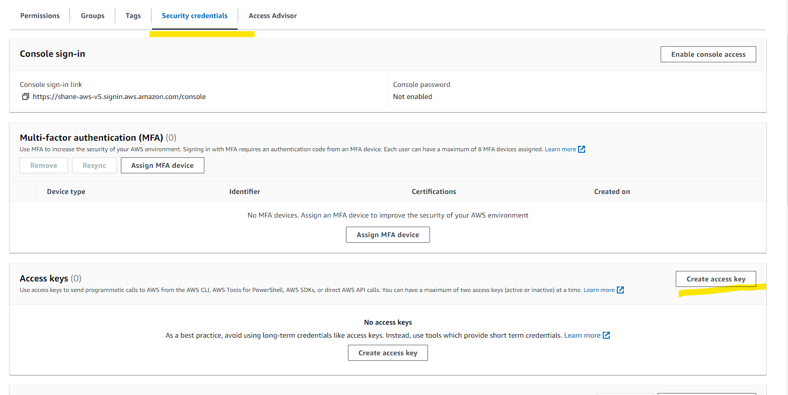
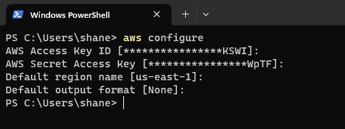

### 2. Configuring terraform to access AWS

---

To create our project we need to add support for terraform in our code editors. If your using vscode or pycharm download the terraform extension. Next in your project folder create a file called "main.tf".

```
terraform {
required_providers {
aws = {
source  = "hashicorp/aws"
version = "~> 4.0"
}
}
}

# Configure the AWS Provider

provider "aws" {
region = "us-east-1"
shared_config_files      = ["/Users/shane/.aws/conf"]
shared_credentials_files = ["/Users/shane/.aws/credentials"]
profile = "default"
}
```

The code above grants permission to terraform so it can access our aws. The "shared config_files" and "shared_credential_files" contain our access key and secret access key for terraform to establish a connectin to aws. If your using a different operating system your configuration files will be located in a different folder. Refer to [Docs overview](https://registry.terraform.io/providers/hashicorp/aws/latest/docs) to find your specific configuration. Next run the following command `terraform init` in the terminal where your project file is loacted. This command will download the neccessary files to connect to aws.

### 3. Create a variable file

Going back to our progect folder create a new file called "terraform.tfvars". These variable are swappable so you can configurations and access keys

```
key_pair = "file_server"
ami-id = "ami-044b654780812c565"
instance = "t2.medium"
```

### 4. Creating a EC2 instance with Terraform

Next we will create a EC2 instanace with the Filecloud image installed. To do this go back to the aws console and type EC2 i the search bar. On the side menu click on AMI Catalog. Here you will search for "filecloud" in the AWS marketplace.

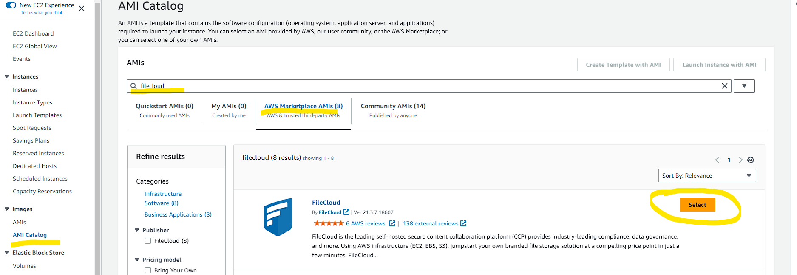

Select the first ami that shows up and then click continue on the next screen. This will return you back to the AMI Catalog landing page. This time however the ami id will now display. Copy the ami id to the variable ami-id in the variable file. This step is nesseccary because amis are changing all the time and you may need to get a different ami depending on when your following this tutorial.


Before we leave the console we need to create a key pair so we can ssh into our amazon instance. Currently this cannot be done through terraform and must be done in the console. Navigate to "key pairs" under Network and Secrurity and click "create key pair" on the upper right hand side. Give your key pair a name, in my case I called it "file_server". Select RSA and .pem option then create the key pair. The key pair will download as .pem file. I suggest saving it in your project folder and including it in the .gitignore. Copy the key name into the key_pair variable in your variable file.

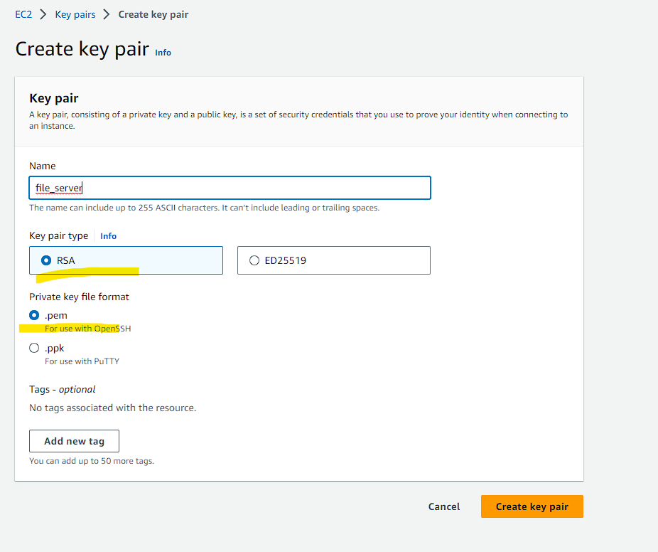

Finally to create our EC2 instance use following code. The first part of the code declares our variables. The second part of the code will create our EC2 instance. We will create the vpc security group in the next section.

```
variable "key_pair" {
  description = "keypair for ec2 ssh"
}

variable "ami-id" {
  description = "ami id"
}

variable "instance" {
  description = "file cloud instance type"
}
```

```
resource "aws_instance" "file_server" {
  ami = var.ami-id
  instance_type = var.instance
  key_name = var.key_pair
  vpc_security_group_ids = [aws_security_group.fc_sg.id]
  tags = {
    Name = "file server"
  }
}
```

### ***Note I used a t2.medium which is not free tier eligible. To use the free tier change the instance type to a t2.micro in the variable file.***

### 5. Create a Security Group

We need a security group to allow inbound traffic from HTTP, HTTPS and SSH. The configuration below will create a security group called "fc_sg" and we will attached it to our EC2 instance.

```
data "aws_vpc" "default" {
  default = true
}

resource "aws_security_group" "fc_sg" {
  name = "fc-sg"
  description = "Allow HTTP/S and SSH"
  vpc_id = data.aws_vpc.default.id
}

resource "aws_security_group_rule" "allow_https" {
 type              = "ingress"
 description       = "HTTPS ingress"
 from_port         = 443
 to_port           = 443
 protocol          = "tcp"
 cidr_blocks       = ["0.0.0.0/0"]
 security_group_id = aws_security_group.fc_sg.id
}

resource "aws_security_group_rule" "allow_http" {
 type              = "ingress"
 description       = "HTTP ingress"
 from_port         = 80
 to_port           = 80
 protocol          = "tcp"
 cidr_blocks       = ["0.0.0.0/0"]
 security_group_id = aws_security_group.fc_sg.id
}

resource "aws_security_group_rule" "allow_all" {
 type              = "egress"
 description       = "allow all"
 from_port         = 0
 to_port           = 0
 protocol          = "-1"
 cidr_blocks       = ["0.0.0.0/0"]
 security_group_id = aws_security_group.fc_sg.id
}
resource "aws_security_group_rule" "allow_ssh" {
 type              = "ingress"
 description       = "SSH ingress"
 from_port         = 22
 to_port           = 22
 protocol          = "tcp"
 cidr_blocks       = ["0.0.0.0/0"]
 security_group_id = aws_security_group.fc_sg.id
}
```

### 6. Create S3 bucket

---

S3 is a cheap way to storage files and data. We will use S3 as a storage system for our EC2 instance. The following code will provison a s3 bucket.

```
resource "aws_s3_bucket" "storage_s3" {
  bucket = "my-fs-storage"
  tags = {
    Name = "file server storage"
  }
}
```

### 7. Configuirng S3

---

Now that we have a s3 bucket we need to create a user and user policy then attach it to our s3 bucket. We will also create a access key that filecloud will need to to access our bucket. Use `terraform apply` to spin up all these services.

```
resource "aws_iam_user" "filecloud_user" {
  name = "fc_user"
}

data "aws_iam_policy_document" "filecloud_policy" {
  version = "2012-10-17"
  statement {
    effect = "Allow"
    actions = ["s3:CreateBucket",
              "s3:DeleteObject",
              "s3:GetObject",
              "s3:ListBucket",
              "s3:PutObject"]
    resources = ["arn:aws:s3:::*"]
  }
}

resource "aws_iam_user_policy" "filecloud_policy" {
  name = "fcp"
  user = aws_iam_user.filecloud_user.name
  policy = data.aws_iam_policy_document.filecloud_policy.json
}

resource "aws_iam_access_key" "fc_user_access_key" {
  user = aws_iam_user.filecloud_user.name
}

output "secret" {
  value = {
    "key"      = aws_iam_access_key.fc_user_access_key.id
    "secret"   = aws_iam_access_key.fc_user_access_key.secret
  }
  sensitive = true
}
```

### 8. Getting a filecloud account and license

We know have all the required infrastructure to setup our cloud file server. Sign up a free trial of [FileCloud Community Edition](https://ce.filecloud.com/#communityTrial). This will give you a 1 year license, no credit card is neseccary. Once you signed up you download the license file into your project folder and make sure to include it in you .gitignore.

### 9. SSH into your EC2 instance

To access your file server go back to the aws console, select your instance and find the Public IP4 DNS address. Copy it and paste it into a new tab and add /admin to the end. This will bring you to the login landing page for your server. The username is "admin" and password is your instance ID as shown below.

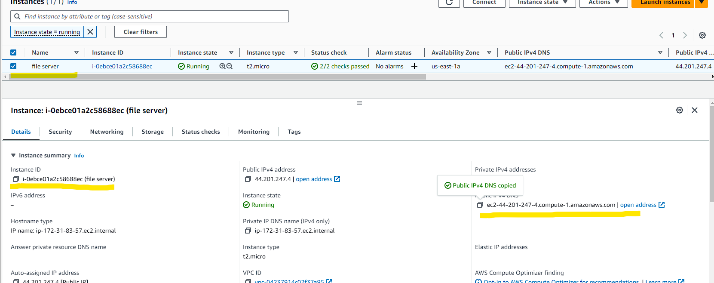

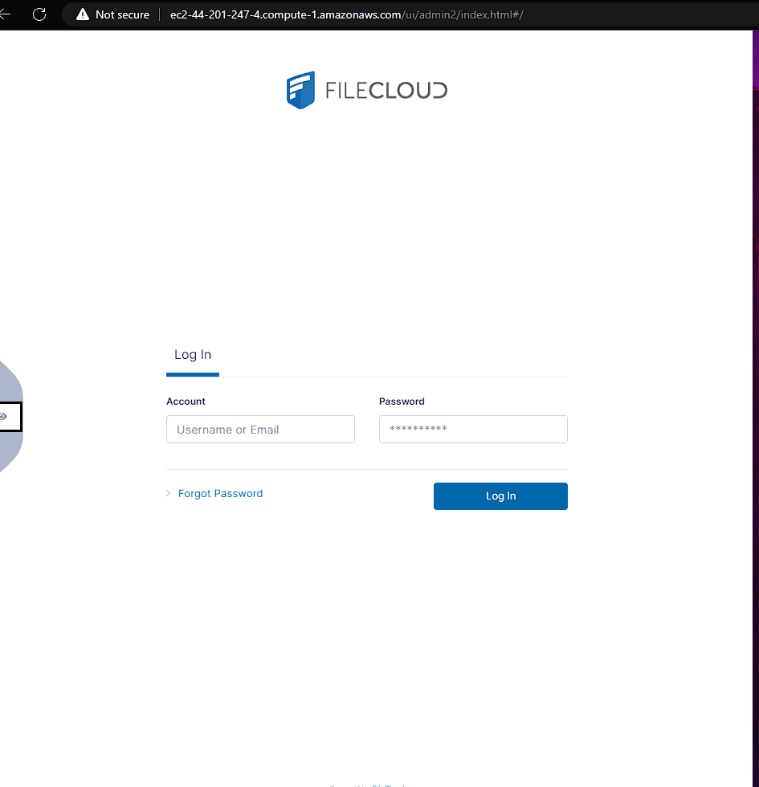

Once you login you will have to provided the licence file in step 6.

### 10. Configuring FileCloud to access S3

---

Navagate to the seetings in filecloud and locate the storage settings. If you click "check path" you will notice we are using the local path and not s3. To use s3 we need to SSH into our instance and change the path.

Open a terminal where you save your .pem file that we downloaded in step 3. For me it is located in my project folder. Go to the AWS console, select your instance and select "Connect' on the top right corner.

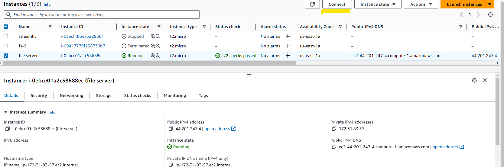

Go to the SSH client and copy the terminal command to SSH into your instance. Then copy this into the terminal. You may encounter a error say "Permissions for '.pem' are to open" if so follow this guide to resolve the issue. [Windows SSH: Permissions for &#39;private-key&#39; are too open](https://superuser.com/questions/1296024/windows-ssh-permissions-for-private-key-are-too-open)

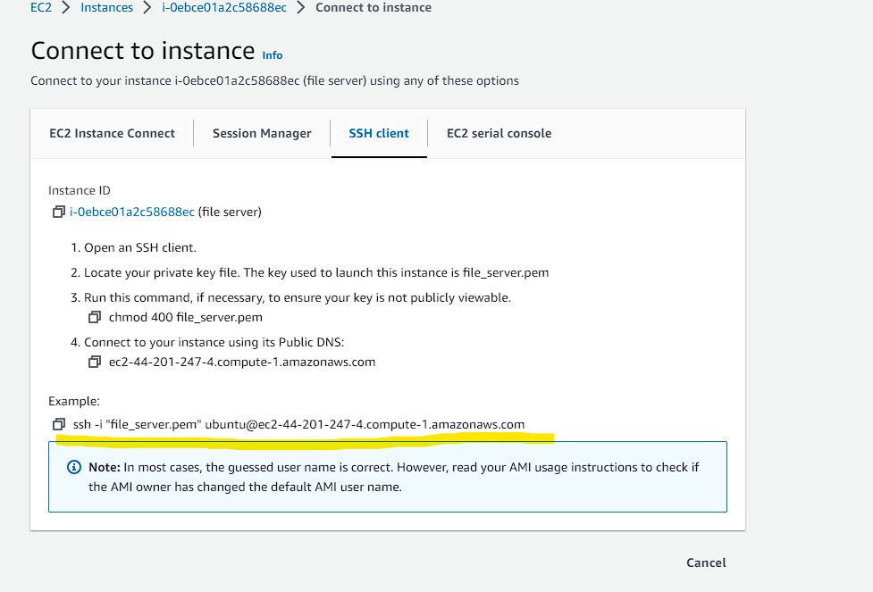

Enter this command `sudo nano /var/www/html/config/cloudconfig.php`. You could Vim if you perfer it over nano. Scroll down to "Storage Implmentation" and change "local" to "amazons3" as shown below. Once change press Ctrl x, then y, and finally enter to save and exit.

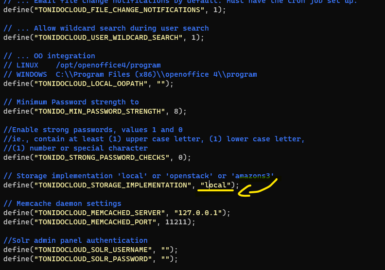

Next enter the followin command
`sudo cp /var/www/html/config/amazons3storageconfig-sample.php /var/www/html/config/amazons3storageconfig.php`

We are done with SSH you can close the terminal.

If we go back to our filecoud you will now notice the storage is s3.

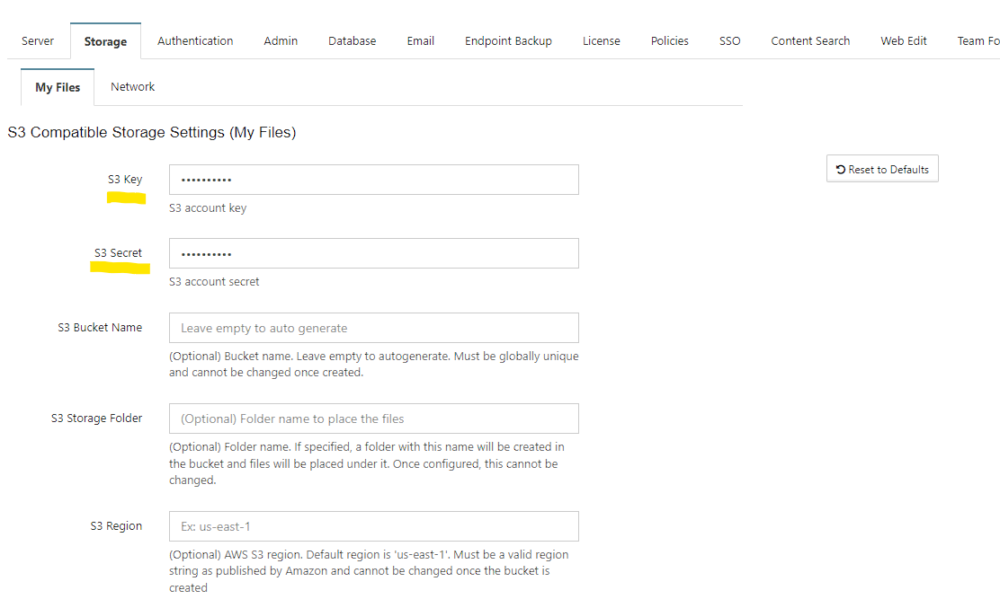

Were not done yet! We need to grant access to filecloud to use s3 so we need a s3 key and secret. We already created one in step 5 S3 configuration. To get access to it open a terminal in you project folder and enter this command `terraform output -json` Copy the key and secret to their repective fields in your filecloud. Addtional fill in your bucket name. I named my s3 bucket my-fs-storage. Save your changes and you should get a "success" pop up if everything was done right.


### Finnishing Touches

---

Congrats you have succesful setup your filecloud server using AWS and Terraform. Here are some additional to-dos

* Setup a dominan name and SSL for filecloud.
* Enable encryption for S3
* Download the mobile app
* Create users (up to 5 in community edition)
* Setup a network drive


